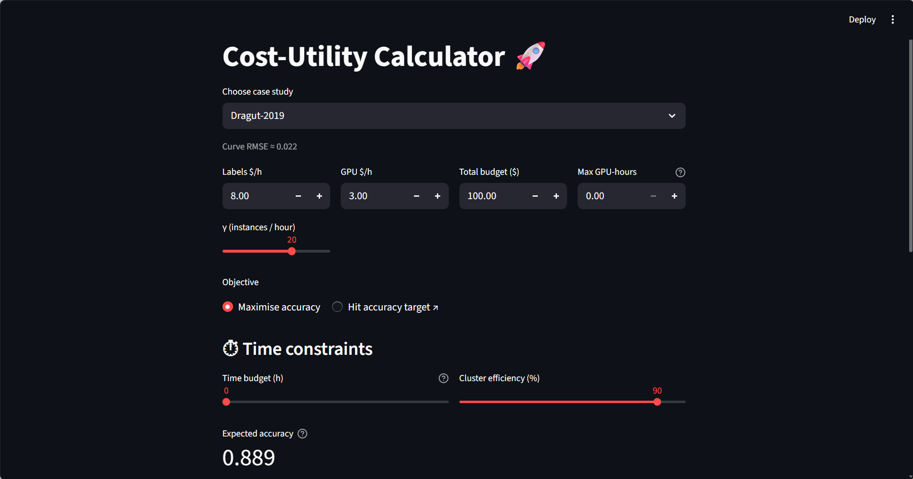
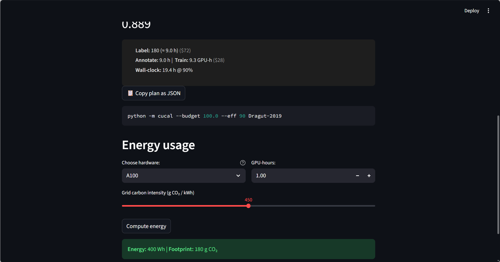
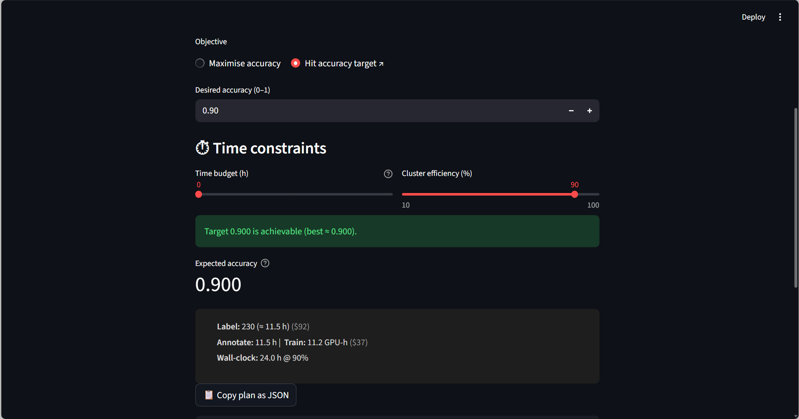

# Cost–Utility Calculator for NLP Model Development

An interactive research tool that optimizes how to allocate a fixed budget between data labeling, GPU compute, and other resources when fine-tuning compact NLP models.
Implements cost–utility curves from recent literature and recommends efficient spending strategies under accuracy, time, and CO₂ constraints.

## Overview

This calculator models the trade-off between human annotation and compute cost in machine learning pipelines.
It fits saturating-log accuracy curves to experimental data (Dragut 2019; Kang 2023; Stiennon 2021) and uses exhaustive or gradient-based optimization to find cost-efficient configurations.

## Key Features
* Multi-resource budget optimizer — labels, GPUs, and developer effort.
* Constraints on total cost, time, and energy (cluster-efficiency aware).
* Curve fitting based on real empirical studies.
* Two interfaces:
  * Command-Line (CLI)
  * Streamlit Web App
* Config-driven architecture (JSON curves, hardware tables).
* Fully unit-tested, modular, and easy to extend.


## Quick Start

```bash
git clone https://github.com/zuzannabak/cost-utility-calculator.git
cd cost-utility-calculator
python -m venv .venv
source .venv/bin/activate    # Windows: .venv\Scripts\activate
pip install -r requirements.txt

```

## Launch the Streamlit App

```bash
streamlit run app.py
```

Then open [http://localhost:8501](http://localhost:8501) in your browser.

## Run from CLI
```bash
python -m cucal.cli \
  --task dragut_2019 \
  --budget 3000 \
  --label-cost 0.07 \
  --gpu-cost 1.50 \
  --max-gpu-hours 800
```

## Repositry Structure
```bash
.
├─ src/cucal/          # Core package: optimizer, curves, config, CLI
├─ data/               # Curves and resource definitions (curves.json)
├─ scripts/            # Validation and automation scripts
├─ tests/              # Unit tests (pytest)
├─ app.py              # Streamlit entry point
└─ README.md           # Project documentation
```

## Documentation & Report

A detailed project report is available here: [View report (PDF)](report.pdf)

The report includes:
- Literature background and methodology
- Curve fitting validation
- Optimization results
- Streamlit UI explanation
- Discussion and limitations

## Visualization and Demo Video

**Figure 1 – GUI: Maximize Accuracy mode**  


**Figure 2 – Resource Allocation & Energy Calculation**  


**Figure 3 – GUI: Hit Accuracy Target mode**  


**Demo Video**  
[▶️ Click here to open `demo.mp4`](assets/demo.mp4)


## References

* Dragut et al., Human-in-the-Loop Entity Extraction (KDD 2019)
* Kang et al., Distill or Annotate? Cost-Efficient Fine-Tuning (2023)
* Stiennon et al., Learning to Summarize with Human Feedback (EMNLP 2021)

## Author
Zuzanna Bąk
M.S. Computational Data Science, Temple University
zuzanna.bak@temple.edu
