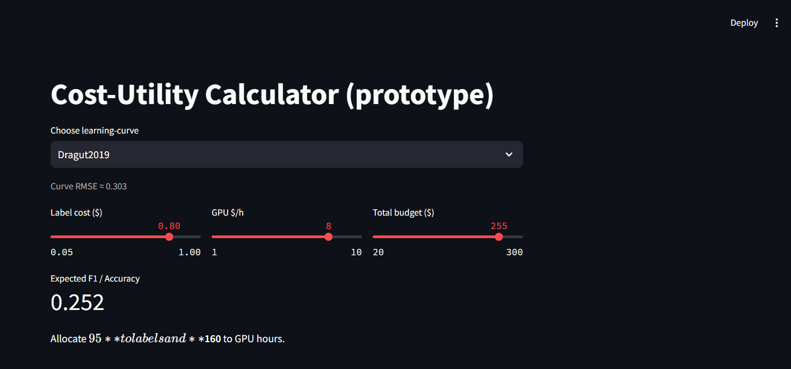

# Cost-Utility Calculator for NLP Model Development

Economic decision-support tool that recommends how to split a fixed budget
between **knowledge-distillation compute** and **human annotation** when fine-tuning
compact NLP models.

## Project Goals
1. Formalise the allocation problem with marginal-utility economics.
2. Build a lightweight simulation (Python) that takes user-entered costs and
   outputs the optimal budget mix, expected accuracy, time, and optional CO₂.
3. Validate on two case studies: regex-style entity extraction & RL summarisation.

## Folder Structure
📁 notebooks/ – Jupyter prototypes and analysis  
📁 src/ – reusable Python modules  
📁 data/ – small sample datasets (keep < 10 MB)  
📁 docs/ – figures, literature-review matrix  
requirements.txt – Python dependencies

## Quick Start (local)
```bash
git clone https://github.com/<USER>/cost-utility-calculator.git
cd cost-utility-calculator
conda create -n cucal python=3.11
conda activate cucal
pip install -r requirements.txt
jupyter lab
```

## Roadmap
 **Week 0** – confirm abstract; register independent study  ✔  
 **Week 1** – literature-review matrix + first prototype curves  ✔  
 **Week 2** – fit cost/utility curves to data  ✔  
 **Week 3** – implement constrained optimisation routine  ✔  
 **Week 4** – minimal Streamlit (or CLI) front-end (prototype simulator)  ✔ (CLI)  
 **Week 5** – validate on Dragut entity-extraction case  ✔ (WIP ~70%)  
 **Week 6** – generalize to summarisation case & refine simulator  
 **Week 7** – draft report, polish plots, add tests  
 **Week 8** – final demo + 6–8 page report  

**(Timeline is optimistic; project spans the full 12-week summer term.)**

---

## Quick Start

1. **Clone and install**

```bash
git clone https://github.com/zuzannabak/cost-utility-calculator.git
cd cost-utility-calculator
conda env create -f environment.yml   # or pip install -r requirements.txt
streamlit run streamlit_app.py


## References
Dragut E. C. et al. (2019) How to Invest My Time: Lessons from Human-in-the-Loop Entity Extraction. KDD.

Kang J., Xu W., & Ritter A. (2023) Distill or Annotate? Cost-Efficient Fine-Tuning of Compact Models. arXiv:2305.01645.

Stiennon N. et al. (2021) Learning to Summarize with Human Feedback. EMNLP.
